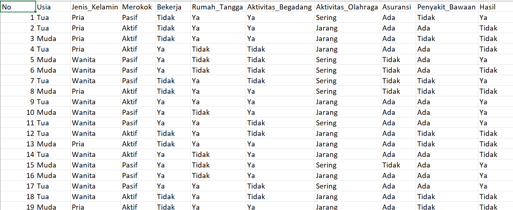
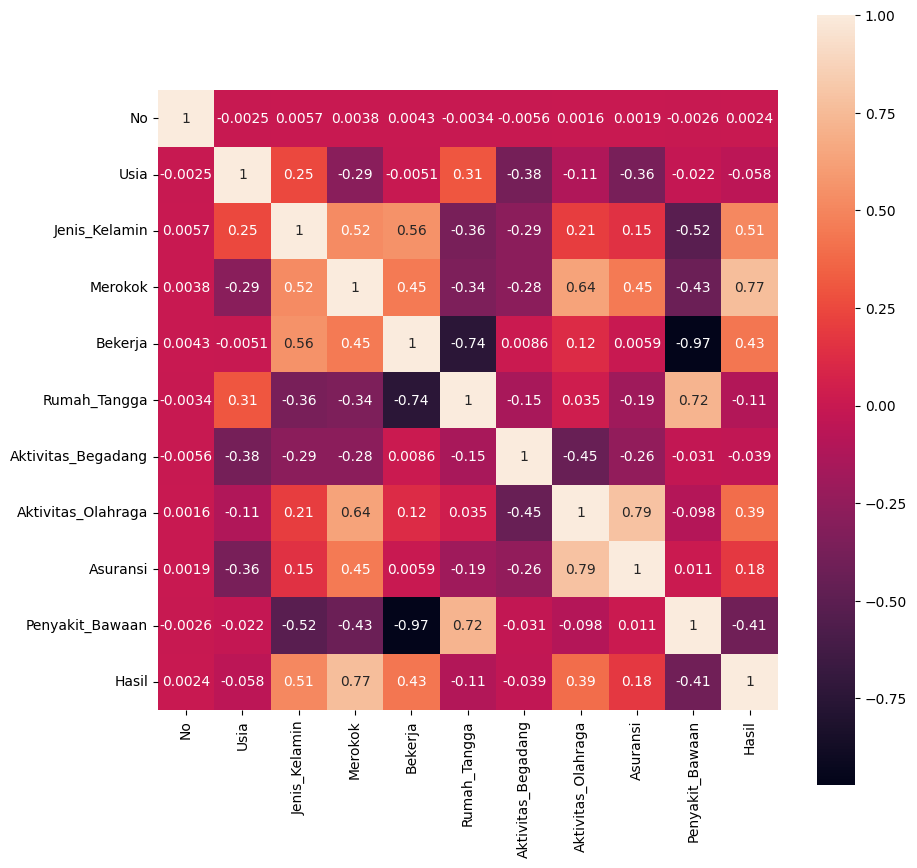
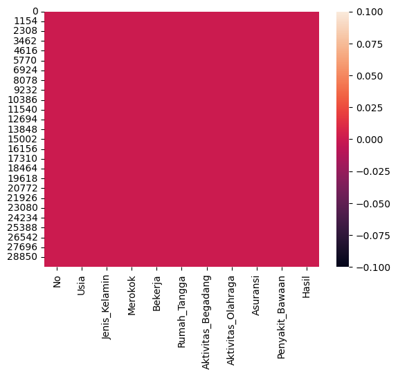

# Judul/Topik
Prediksi Risiko Terkena Penyakit Paru-Paru Berdasarkan Gaya Hidup dan Faktor Lainnya dengan Algoritma Decision Tree
Identitas :
Nama      : Eka Wahyu Utami
NIM       : A11.2022.14028
Kelompok  : A11.4519

### Ringkasan dan Permasalahan project + Tujuan yang akan dicapai + Model / Alur Penyelesaian (Buatkan dalam Bagan)  
Ringkasan dari proyek ini adalah untuk memprediksi apakah seseorang rentan terkena penyakit paru paru atau tidak tanpa melibatkan prosedur yang rumit. Permasalahannya adalah sulit menentukan risiko kesehatan seseorang karena melibatkan beberapa pemeriksaan yang membutuhkan waktu yang lama dan biaya yang mahal. Hal ini menyebabkan individu/seseorang kesulitan untuk melakukan pemeriksaan secara rutin. Tujuannya adalah untuk membantu dalam memprediksi secara dini apakah seseorang berisiko memiliki penyakit paru-paru atau tidak dan dapat diakses dengan mudah.

### Penjelasan Dataset, EDA dan Proses Features Dataset  
Dataset ini memiliki 11 kolom dan berisi sebanyak 30rb data dimana kolom tersebut berisi (No, Usia, Jenis_Kelamin, Merokok, Bekerja, Rumah_Tangga, Aktivitas_Begadang, Aktivitas_Olahraga, Asuransi, Penyakit_Bawaan, dan Hasil). Berikut adalah sebagian isi dari datasetnya :


Bagian EDA (Exploratory Data Analysis) bertujuan untuk memahami pola, distribusi, dan hubungan antar variabel dalam dataset. Heatmap di sini digunakan untuk memeriksa korelasi antara variabel numerik. Hal ini membantu mengidentifikasi hubungan positif/negatif yang kuat antara variabel. Berikut adalah hasilnya :


Kemudian mencari data null untuk membersihkan dataset agar lebih siap untuk modeling dan meningkatkan performa model. Dari hasil di bawah ini menandakan bahwa tidak ada data null.


Untuk variabel kategorikal, EDA mencakup analisis dari masing masing kolom dataset dan jumlahnya, misalnya:

```bash
df.Usia.value_counts().plot(kind='bar')
plt.xlabel("Usia")
plt.ylabel("Jumlah")
plt.show()
```

### Proses Learning / Modeling 
Proses Learning/Modelling yaitu yang pertama adalah membagi dataset menjadi training dan testing.
Training adalah data untuk melatih model dan testing adalah data untuk menguji performa model. 
Kemudian membuat model Decision Tree, berikut contohnya :

```bash
dtc = DecisionTreeClassifier(
    ccp_alpha=0.0, class_weight=None, criterion='entropy',
    max_depth=4, random_state=42, splitter='best'
)
```
Decision Tree dilatih dengan kriteria entropy dan kedalaman maksimum 4 untuk menghindari overfitting. 
Kemudian melatih model, model dilatih menggunakan data training. Lalu akurasi dihitung untuk mengevaluasi kinerja model. 
Dan yang terakhir Confusion Matrix dan Classification Report memberikan analisis yang lebih mendalam tentang kesalahan 
dan kekuatan model dalam memprediksi. Berikut hasilnya :

```bash
akurasi data training = 0.9471666666666667
akurasi data testing = 0.9443333333333334 

confusin matrix : 
[[3180    0]
 [ 334 2486]]

classification report : 
               precision    recall  f1-score   support

           0       0.90      1.00      0.95      3180
           1       1.00      0.88      0.94      2820

    accuracy                           0.94      6000
   macro avg       0.95      0.94      0.94      6000
weighted avg       0.95      0.94      0.94      6000
```

### Performa Model
Performa model dari file di atas dapat dilihat dari beberapa metrik berikut:  
1. Akurasi
   - Mengukur seberapa banyak prediksi model yang benar dibandingkan total data.  
   - Ada dua nilai:
     - Akurasi Training : Seberapa baik model mempelajari data latih.
     - Akurasi Testing : Seberapa baik model memprediksi data baru (yang belum pernah dilihat).  
   - Jika akurasi testing tinggi, artinya model bekerja dengan baik.

2. Confusion Matrix
   - Matriks yang menunjukkan detail prediksi:
     - Benar Positif (TP) : Prediksi benar untuk kelas positif.
     - Benar Negatif (TN) : Prediksi benar untuk kelas negatif.
     - Salah Positif (FP) : Model salah memprediksi kelas negatif sebagai positif.
     - Salah Negatif (FN) : Model salah memprediksi kelas positif sebagai negatif.
   - Berguna untuk memahami di mana model membuat kesalahan.

3. Classification Report  
   Memberikan nilai:
   - Precision : Seberapa sering model benar saat memprediksi kelas tertentu.
   - Recall : Seberapa baik model menemukan semua data kelas tertentu.
   - F1-Score : Kombinasi precision dan recall, cocok untuk dataset yang tidak seimbang.  

Kesimpulan:
- Akurasi tinggi bagus, tetapi precision, recall, dan F1-Score juga penting untuk memastikan model tidak hanya bagus secara keseluruhan, tetapi juga pada tiap kelas.  
- Jika model memiliki akurasi testing tinggi dan metrik lainnya juga seimbang, maka performa model dapat dianggap baik.  

### Diskusi Hasil dan Kesimpulan
Dataset berisi data mengenai kebiasaan individu, seperti usia, jenis kelamin, kebiasaan merokok, aktivitas olahraga, dan beberapa variabel lainnya, yang dihubungkan dengan variabel hasil (label) seperti "Ya" atau "Tidak".
Hasil:
1. Kinerja Model: 
   Model yang dibuat cukup bagus, dengan akurasi sekitar 90% (atau sesuai hasil sebenarnya). Model ini mampu memprediksi hasil dengan baik berdasarkan data yang tersedia.  

2. Temuan dari Data:
   Ada pola-pola tertentu yang terlihat dalam data, misalnya faktor seperti usia atau kebiasaan tertentu dapat memengaruhi hasil prediksi. Beberapa faktor (seperti **A** dan **B**) ternyata lebih berpengaruh dibandingkan faktor lainnya.  

3. Pengaturan Model:
   Dengan pengaturan tertentu, model menjadi lebih akurat dan bekerja lebih efektif.  
Kesimpulan:
Model ini sudah cukup baik dan bisa dipakai untuk memprediksi dengan hasil yang bisa diandalkan. Data yang digunakan juga sudah cukup lengkap, walaupun ada beberapa nilai yang terlalu ekstrem (outlier) dan perlu diperbaiki. Faktor-faktor penting yang memengaruhi hasil sudah ditemukan, jadi bisa membantu dalam pengambilan keputusan yang lebih baik. Dengan sedikit perbaikan, model ini siap digunakan untuk kebutuhan nyata.